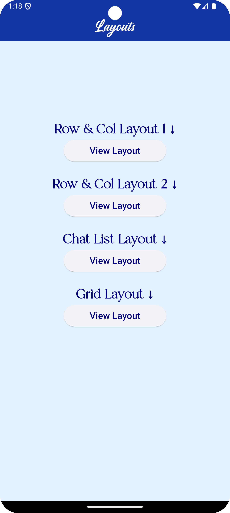
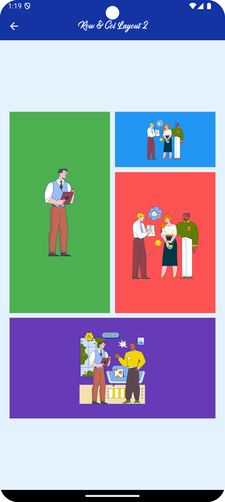
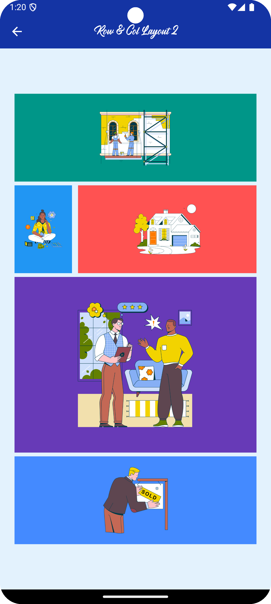
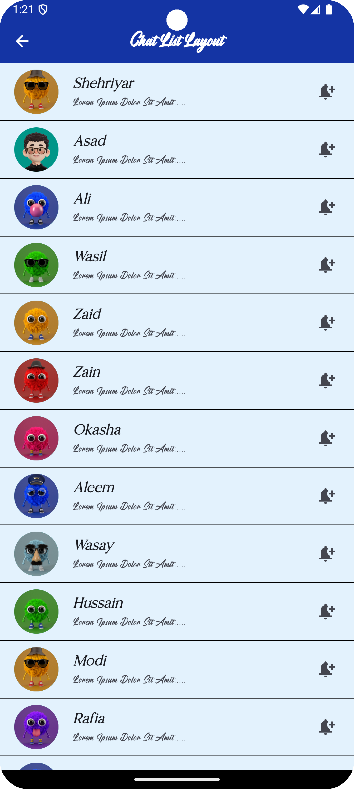
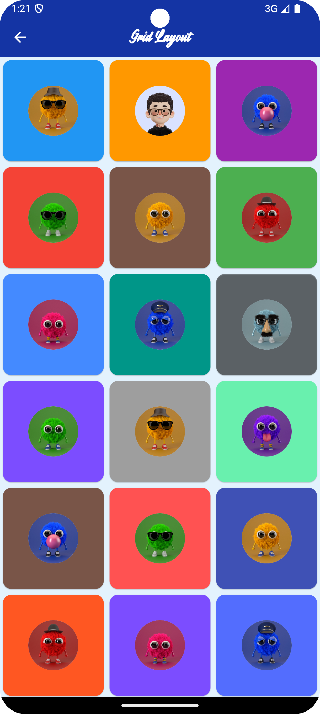

# Flutter Layout Design

This project demonstrates a few essential Flutter layout techniques. I worked on the basic layout design, including the use of `Row`, `Column`, `ListView`, `ListTile`, `CircleAvatar`, and `GridView.builder`. Each layout is a building block for creating dynamic user interfaces in Flutter.

## Features

1. **Row and Column Layouts**:
   - Designed simple layouts using `Row` and `Column`, demonstrating the alignment and spacing between widgets.

2. **Chat List Layout**:
   - Created a chat list using `ListView` and `ListTile`.
   - Each item in the chat list features a `CircleAvatar` to represent the user's profile picture.

3. **Grid Layout with Circle Avatar**:
   - Built a grid layout using `GridView.builder`.
   - Each grid item contains a `CircleAvatar` in the center, demonstrating how to design grids with custom content.

## Screenshots

### First Screen

 
### Row and Column Layout 1

### Row and Column Layout 2

### Chat List Layout

### Grid Layout

